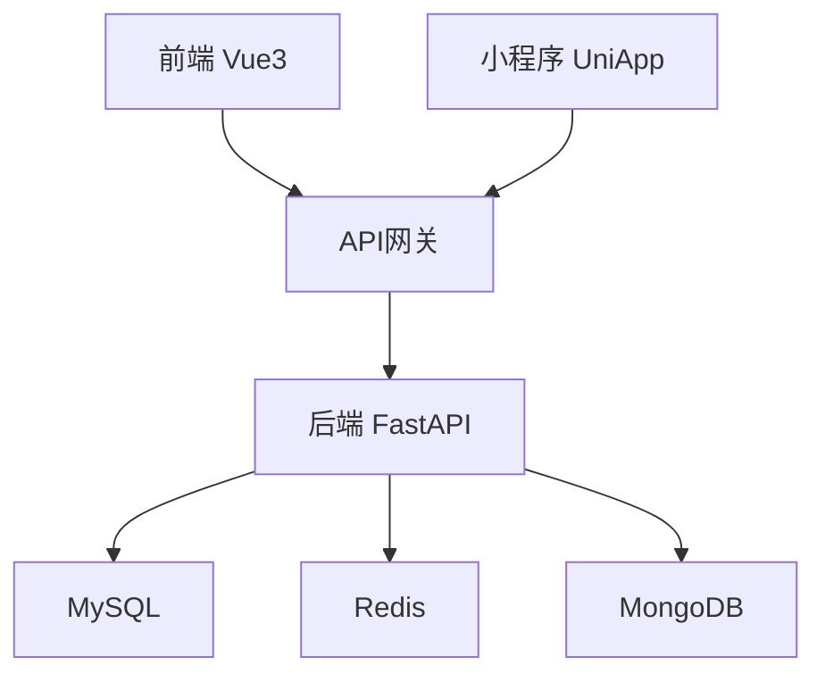

# 为什么是FastapiAdmin？

## 💡你在执着于寻找什么？
 - 找一群志同道合的朋友，做一件有意义的事？
 - 寻找一个亦师亦友的领路人，指引我们前行的方向？
 - 圆梦一个顶级丝滑先进的、完全开源的、容易上手的、长期维护有人答疑的全栈web系统?
 - 在这里，一个开源的FastapiAdmin统统包揽(你会收获技术，你会收获朋友，你会收获老师。甚至你可以看到凌晨3点大哥依旧在奋笔疾书，凌晨两点技术群讨论问题的欢呼雀跃)!

## 🏗️ 系统架构

## 📡技术我们有
### 🚀 现代化全栈技术栈
- 后端基于**FastAPI**（高性能异步框架），前端基于**Vue3 + TypeScript**，技术选型主流、先进。
- 支持**Web + 小程序**多端开发，一套代码多处运行，降低开发与维护成本，容易上手。

### 🧩 高度模块化设计
- 前后端完全分离，功能模块解耦，结构清晰，易于定制和扩展。
- 提供详细二次开发教程与文档，适合中大型项目快速迭代。

### ⚡ 高性能与高安全性
- 基于**异步框架 + Redis缓存**，接口响应速度快。
- 支持**JWT + OAuth2 认证**与**RBAC权限控制**，系统安全有保障。

### 🛠️ 开箱即用，功能丰富
- 内置用户管理、权限控制、日志监控、任务调度等常见中后台功能。
- 提供主题切换、锁屏、可视化工具等细节功能，提升用户体验。

### 📦 部署简单灵活
- 支持**Docker Compose一键部署**，快速搭建生产环境。
- 也支持传统部署方式（Nginx + 手动部署），适应不同运维需求。

### 📘 中文友好，文档详尽
- 全中文开发文档 + 中文化界面，降低学习成本。
- 社区活跃，提供微信交流群，及时获取帮助与支持。

## 🤝 贡献指南

欢迎任何形式的贡献，包括但不限于：
- 提交代码修复
- 改进文档
- 提交新功能建议
- 报告bug

请查看我们的[贡献指南](about.md#关于我们)了解详情。

## 💪团队我们有
### ⚓项目的"定海神针"
[@1014TaoTao](https://gitee.com/tao__tao)深耕高精尖技术行业数十年，有着丰富的代码经验，作为团队的核心带头人，他不仅是技术深耕者，更是开源精神的践行者，常常凌晨仍在代码库中打磨功能、优化架构，为项目锚定清晰的发展方向。面对开发者的疑问，他总能耐心答疑、分享经验，从技术选型到难题攻克全程把关；同时，他也积极营造活跃的交流氛围，让团队与社区的每一次探讨都能转化为项目迭代的动力。
### 🛠️高性能架构的"搭建者"与"塑造者"
团队专注于打造高性能、高安全的异步架构，将大哥的思想进行逐步落实。把流畅交互与友好体验融入架构设计，小到主题切换细节，大到多端适配逻辑，都力求精准呈现产品价值。在完成代码开发的同时，团队更主动肩负社群答疑责任 —— 无论是技术群里开发者遇到的二次开发难题，还是使用过程中碰到的功能适配问题，成员都会及时响应、分享解决方案，用专业与耐心搭建起项目与用户之间的信任桥梁，**让开源不仅是代码的共享，更是技术与经验的互助传递。**

---

> ✅ 如果你需要一个技术先进、功能丰富、易于扩展、容易上手、且完全开源的中后台快速开发平台，**Fastapi-Vue3-Admin** 是一个绝佳的选择。尤其适合 Python + Vue3 技术栈的团队或个人快速构建企业级管理系统。

📌 **项目地址**：
- Gitee：[https://gitee.com/tao__tao/FastapiAdmin](https://gitee.com/tao__tao/FastapiAdmin)
- GitHub：[https://github.com/1014TaoTao/FastapiAdmin](https://github.com/1014TaoTao/FastapiAdmin)
- [联系 or 加入我们](about.md#关于我们)

🙌 **无论你是否喜欢这个项目，都希望你能够给个 ⭐ Star 支持！小小的种子蕴含着大大的能量，终有一天星星之火，可以燎原。**

🙌 **如果你对 Fastapi-Vue3-Admin 技术有浓厚的兴趣，也欢迎你加入我们一起学习一起进步。**